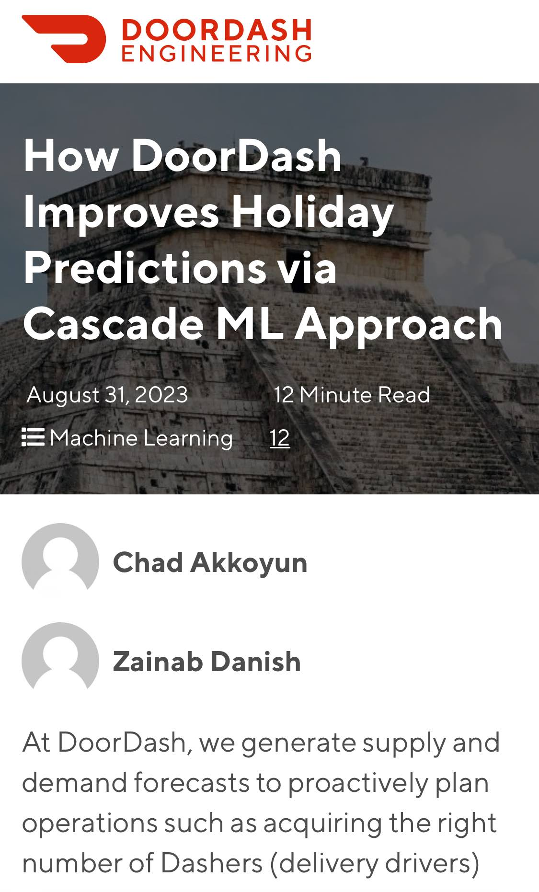

[How DoorDash Improves Holiday Predictions via Cascade ML Approach - DoorDash Engineering Blog](https://doordash.engineering/2023/08/31/how-doordash-improves-holiday-predictions-via-cascade-ml-approach/)

1. Transform your raw data, removing spikes
2. Fit a trend like to the transformed data
3. Predict tomorrow using transformed predicfions
4. reverse The transformation to get expected numbers. 

It's kinda of the principle behind differencing: it's making more stationary a time series. 

{.preview-image}
