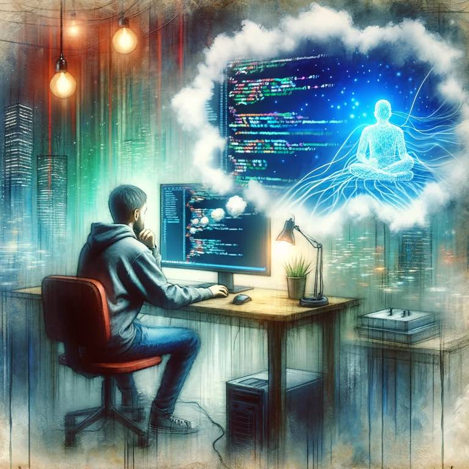

{.preview-image}

I returned from vacation yesterday and tried running my code. It didn't work. I looked at code I had written, it had my imports correctly and all - why wasn't it running?

The file it was importing didn't exist. 

I thought I created that. I swear I made it. My coworker remarked, "oh so you set up all the scafffolding but didn't write the actual code?" I was in disbelief. maybe it was deleted by accident or stashed on another branch. But the `git log` shows all: the imported file never existed. 

In [Dune](../book-review/dune.md), Paul Atriedes has many visions and the author uses this feature to skip the book ahead three years. Paul wakes up one morning and doesn't know what's past or future. It's all one in his mind. 

So it is with software. It gets created in the mind near instantly. Coding is a burden, the journey of many failures and design choices to enable the simple vision of the mind. 

Perhaps Gen AI can help us dream software faster. I look forward to when my dreams are realities, and not the rude awakening I still have coding to do. 