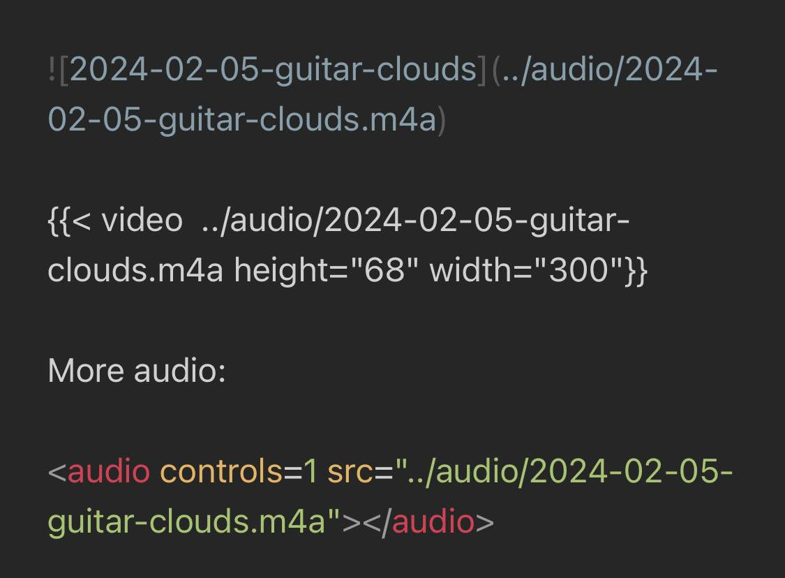
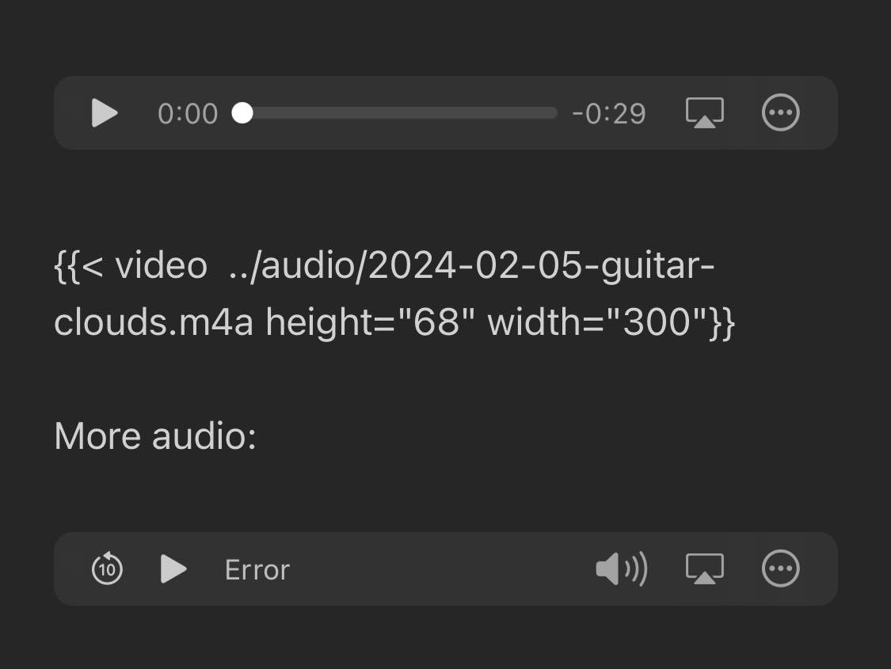
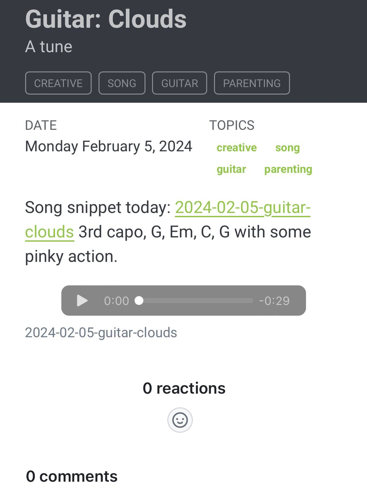

I want to embed just a plain audio file in my blog post. 

Check out the post [Guitar: Clouds](../creative/guitar-clouds.md), where I embed some audio using the quarto video short link: [Quarto – Videos](https://quarto.org/docs/authoring/videos.html). 

My process:

- take a voice recording with my voice notes on iOS. 
- Save to files, I did audio/ folder ([How to blog from your phone using quarto (or hugo/jekyll/etc) using Working Copy and Obsidian](../posts/quarto-from-phone/index.md))
- Then if I link using a standard markdown link it'll create an audio recording in a new browser. If I use the video shortcode then quarto will embed it as a video right in the post (doesn't open a new browser). You can adjust the height so it's not a massive black screen.

```

Song snippet today: [2024-02-05-guitar-clouds](../audio/2024-02-05-guitar-clouds.m4a) 3rd capo, G, Em, C, G with some pinky action. 


<-- This works on safari, not chrome desktop for some reason --> 




```

Hope this helps someone!


Note, the second way (`the ![]`) approach didn't work on Chrome Desktop, but works on Safari desktop, safari mobile, and chrome mobile:


If I inspect the HTML I can see the audio tag is created in Chrome, it's just not showing a player or anything. 

But the mobile audio player is picked up: 

{.preview-image}


# Obsidian

I like using this markdown syntax in Obsidian because that's where I write my notes. 



Because it appears like an audio player in app. The `` syntax is a `quarto` thing and renders nicely. The `<audio>` tag is supposed to work but doesn't in my vault. In my app it looks like this;



So yes, the markdown link is the most usable, works on most browsers, and works in Obsidian. Just doesn't work on Chrome Web...(at least not on my version).

Seems also that using the `<audio>` tag breaks my quarto:



# In Summary

I've found two ways of showing audio in quarto. 1) using the image syntax in markdown and 2) using a video shortcode. The markdown syntax works great locally on my iPhone and on most browsers, but the video shortcode seems to work on all browsers. 