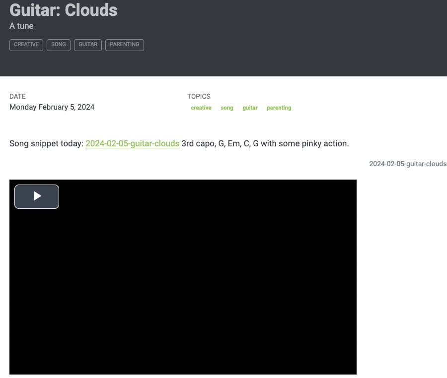
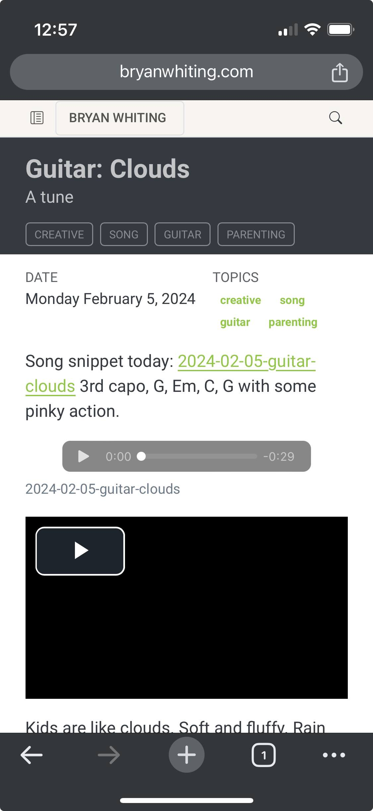

I want to embed just a plain audio file in my blog post. 

Check out the post [Guitar: Clouds](../creative/guitar-clouds.md), where I embed some audio using the quarto video short link: [Quarto – Videos](https://quarto.org/docs/authoring/videos.html). 

My process:

- take a voice recording with my voice notes on iOS. 
- Save to files, I did audio/ folder ([How to blog from your phone using quarto (or hugo/jekyll/etc) using Working Copy and Obsidian](../posts/quarto-from-phone/index.md))
- Then if I link using a standard markdown link it'll create an audio recording in a new browser. If I use the video shortcode then quarto will embed it as a video right in the post (doesn't open a new browser). You can adjust the height so it's not a massive black screen.

```

Song snippet today: [2024-02-05-guitar-clouds](../audio/2024-02-05-guitar-clouds.m4a) 3rd capo, G, Em, C, G with some pinky action. 


<-- This works on safari, not chrome desktop for some reason --> 




```

Hope this helps someone!


Note, the second way (`the ![]`) approach didn't work on Chrome Desktop, but works on Safari desktop, safari mobile, and chrome mobile:



But the mobile audio player is picked up: 

{.preview-image}

