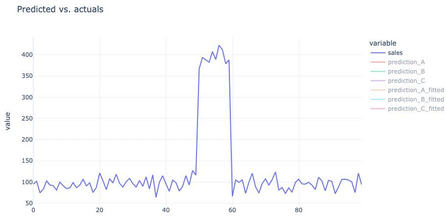
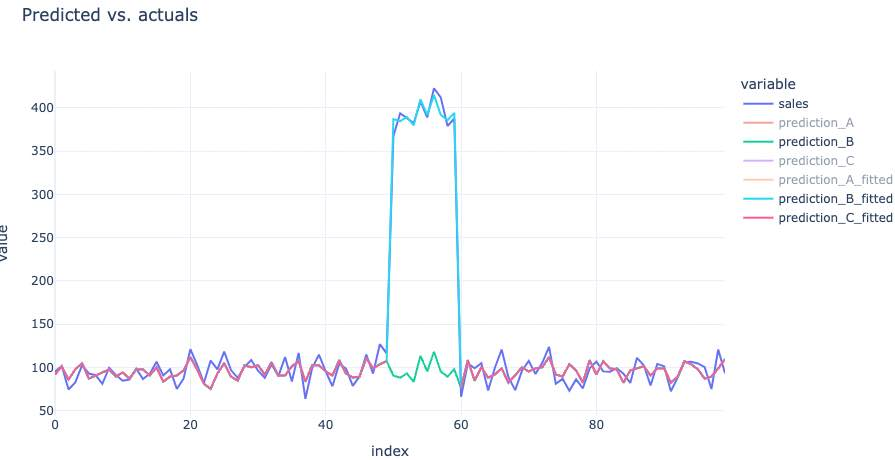

So you have an outlier in your data. How do you handle it?

Well, you can either include it or drop it from your data. If you include it, it may bias your regression coefficient. 

Let's assume you have some data where you have X = Emails Sent and Y = Sales. You want to know the effect of email on sales. 

You have three options:

- A: fit the model on 100% if data, and don't account for the outlier. 
- B: Create a dummy variable that's 1 for outlier and 0 otherwise. 
- C: drop the outlier from your data and fit without a special feature. 

It turns out that options B and C are identical in their predictions for non-outlier time periods. Effectively, you isolate the effect of those outliers when you create a dummy variable for them. Let's take a look. 

Here we have some sales data over time: 

{.preview-image}

Now I'm going to fit a model as above and get the "fitted values", or in-sample predictions. We can see from this that the A model (no outlier treatment) has a higher line. This is the effect of the outlier on the slope. But the B model fits the data near perfectly. You'll notice the C model and the B model are perfectly overlapping except for the gap on C (remember we dropped rows, so we didn't have in-sample fitted values there!)

{.preview-image}

Now, the model B is Y = intercept + email + is_holiday Boolean. If you make a prediction assuming is_holiday = 0 then you get the green line. This is the effect of making a prediction of what your sales would have been if it wasn't a holiday. This is one way to get a "baseline". Then the blue line is the predicted value with holiday = 1. The gap between blue and green is the effect of your holiday (I could show the model coefficients but I'm lazy!)

{.preview-image}

Okay, last interesting bit: what would the prediction of the model C be during this holiday period? Remember, we don't have in-sample predictions (fitted values) because we dropped those rows. So technically, this middle spot is "out of sample" for model C. 

What do we see? Well since the slope for "email" is the same for model C and B, the predictions are near identical. Let's add in the model C non-fitted line:

{.preview-image}

What do we see? We see that model C (purple line) overlaps the green line perfectly. 

So per this simple example, there are two ways of handling an outlier:

1. Drop it from your data (not ideal)
2. Use feature engineering to handle it (ideal)

In a more complicated setting, there are tons of real world interactions in your data that make this even more complicated. But with good feature engineering you can isolate the effect of those outliers or subgroups. 

I hope this helps. As always, always test the principle on your own data before fully trusting this principle. There may be something specific about your data or your model where this may not apply exactly (such as using decision trees or a GLM or GAM).

Lastly, it's a beautiful world. You can ask ChatGPT to code up these analyses really quickly. Do you have a debate at work? Ask ChatGPT to run a simulation. 

# See also

In this DoorDash blog, they provide a unique solution for XGBoost, mostly because XGBoost has a hard time extrapolating. But there are other ways to handle your data. 

[Holiday Demand Forecasting using XGBoost](holiday-demand-forecasting-using-xgboost.md)

# Appendix  (Code)

Here's the code to reproduce the above, thanks to help with ChatGPT:

``` 
import pandas as pd
import numpy as np
import statsmodels.api as sm

# Setting a random seed for reproducibility
np.random.seed(42)

# Generating a time series dataset
n = 100  # number of days
emails_sent = np.random.poisson(lam=50, size=n)  # average 50 emails sent per day
sales = 20 + 1.5 * emails_sent + np.random.normal(0, 10, n)  # base sales equation
is_holiday = np.zeros(n)

# Introducing an outlier (e.g., holiday sales)
indexes = [50, 51, 52, 53, 54, 55, 56, 57, 58, 59]
for ix in indexes:
    sales[ix] += 300 + np.random.normal(0, 10, 1)  # significant spike in sales
    is_holiday[ix] = 1  # flagging the outlier

# Preparing datasets for the three options
df = pd.DataFrame({'emails_sent': emails_sent, 'sales': sales, 'is_holiday': is_holiday})

# Option A: Including the outlier
X_A = sm.add_constant(df['emails_sent'])
y_A = df['sales']

# Option B: Including the outlier and a dummy variable
X_B = sm.add_constant(df[['emails_sent', 'is_holiday']])
y_B = df['sales']

# Option C: Excluding the outlier
df_C = df[df['is_holiday'] == 0]
X_C = sm.add_constant(df_C['emails_sent'])
y_C = df_C['sales']

# Fitting the models
model_A = sm.OLS(y_A, X_A).fit()
model_B = sm.OLS(y_B, X_B).fit()
model_C = sm.OLS(y_C, X_C).fit()


# Adding labels and legend
plt.xlabel('Emails Sent')
plt.ylabel('Sales')
plt.title('Sales vs Emails Sent with Model Slopes')
plt.legend()

# Display the plot
plt.show()


# Extracting the coefficients for the 'emails_sent' predictor
coef_A = model_A.params['emails_sent']
coef_B = model_B.params['emails_sent']
coef_C = model_C.params['emails_sent']

model_A.summary()
model_B.summary()
model_C.summary()

(coef_A, coef_B, coef_C)


# Create a dataframe with the raw data
prediction_data = df[['emails_sent', 'sales']].copy()

# Add predictions from each model to the dataframe
prediction_data['prediction_A'] = coef_A * prediction_data['emails_sent'] + model_A.params['const']
prediction_data['prediction_B'] = coef_B * prediction_data['emails_sent'] + model_B.params['const']
prediction_data['prediction_C'] = coef_C * prediction_data['emails_sent'] + model_C.params['const']

prediction_data['prediction_A_fitted'] = model_A.fittedvalues
prediction_data['prediction_B_fitted'] = model_B.fittedvalues
prediction_data['prediction_C_fitted'] = model_C.fittedvalues

df_plt = prediction_data.drop('emails_sent', axis=1).reset_index().melt(id_vars=['index'])
import plotly.express as px

# Create a scatter plot of the raw data
df_fitted = df_plt[df_plt['variable'].str.endswith('fitted')]
fig = px.line(df_fitted, x='index', y='value', color='variable', title='Predidcted vs. actuals')
fig.update_layout(template='plotly_white')
fig.show()


df_remove_outlier = df_plt[~df_plt['variable'].str.endswith('fitted')]
fig = px.line(df_remove_outlier, x='index', y='value', color='variable', title='Predidcted vs. actuals')
fig.update_layout(template='plotly_white')
fig.show()

fig = px.line(df_plt, x='index', y='value', color='variable', title='Predidcted vs. actuals')
fig.update_layout(template='plotly_white')
fig.show()

```