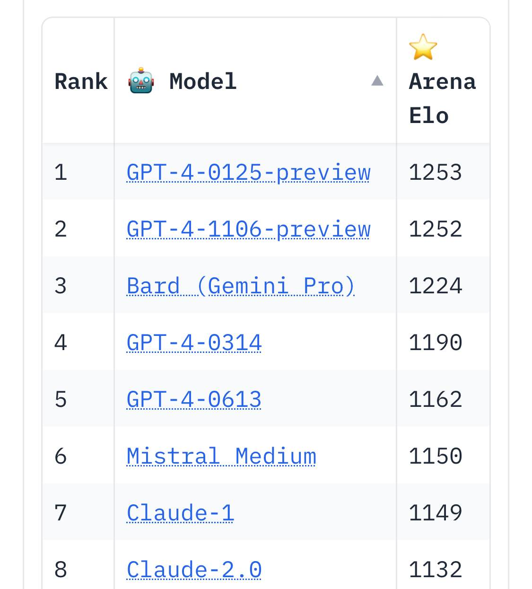

I just came across the [Chatbot Arena](https://chat.lmsys.org/), a place where you can put up a prompt and vote on which LLM has the best output. The leaderboard is here: [LMSys Chatbot Arena Leaderboard - a Hugging Face Space by lmsys](https://huggingface.co/spaces/lmsys/chatbot-arena-leaderboard)

# Chatbot Arena

And after you enter a prompt you can choose, but they don't tell you the name until you vote. 

# Leaderboard

And the output looks like this:

{.preview-image}

Full page:

