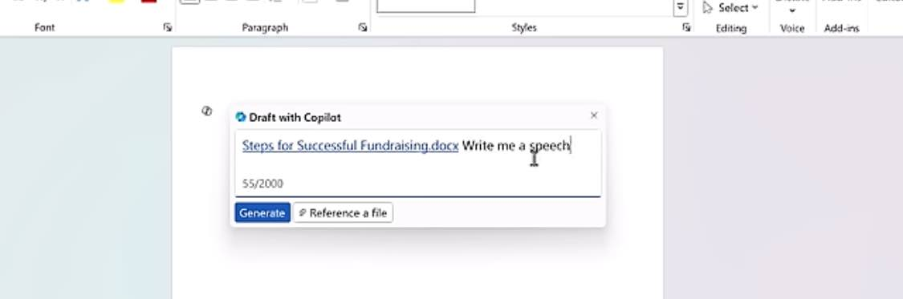

Three copilots:

- copilot.Microsoft.com

[YouTube MS ignite](https://youtu.be/3Nb0FEe3kKw?si=Q8A2T101zA9pxx1B)

 

- uses RAG on the Microsoft graph 
- Copilot can make a PowerPoint from a Doc
- TeamsKit
- plugins and graph connectors. Maybe plugin is right? Maybe graph connector is right. 
- Not very useful PowerPoints unless tied to data 
- LLMs are only as accurate as the data. 

[YouTube create awesome documents](https://youtu.be/7JRaFAYSOgI?si=9NrnsVCO0rGrlAHh)

-  Edit and revise 

[YouTube | Excel tutorial](https://youtu.be/_nf56aMPdZE?si=Z6UR5qKPOvKb4y4d)

- 20-30 second 

[YouTube | MS Cop featurs](https://youtu.be/AhywEEHg6Es?si=PDLQGwIJgaBxivbz)

{.preview-image}

[YouTube | Microsoft Loop is cool](https://youtu.be/oYijejDXLZQ?si=J-08luV6mNJPEgIU)

- loop is cool. Makes collaborating across applications on a single thing easy. 

[YouTube | Global Enterprise](https://youtu.be/Xv_TmtRLHJY?si=H1N_UkWSli2xLJsG)

- you can have it "sound like me" in outlook
- 41:35 copilot studio
- Can use open AIs GPTs 

# Azure open ai

[YouTube](https://youtu.be/obfs_LEzPHo?si=AorIJwEutzw3UVIR)

 

- BRK206 Vector search and state of the art retrieval for generative ai apps 
- BRK205 multimodal

Things to explore:

- TeamsKit
- Azure OpenAI