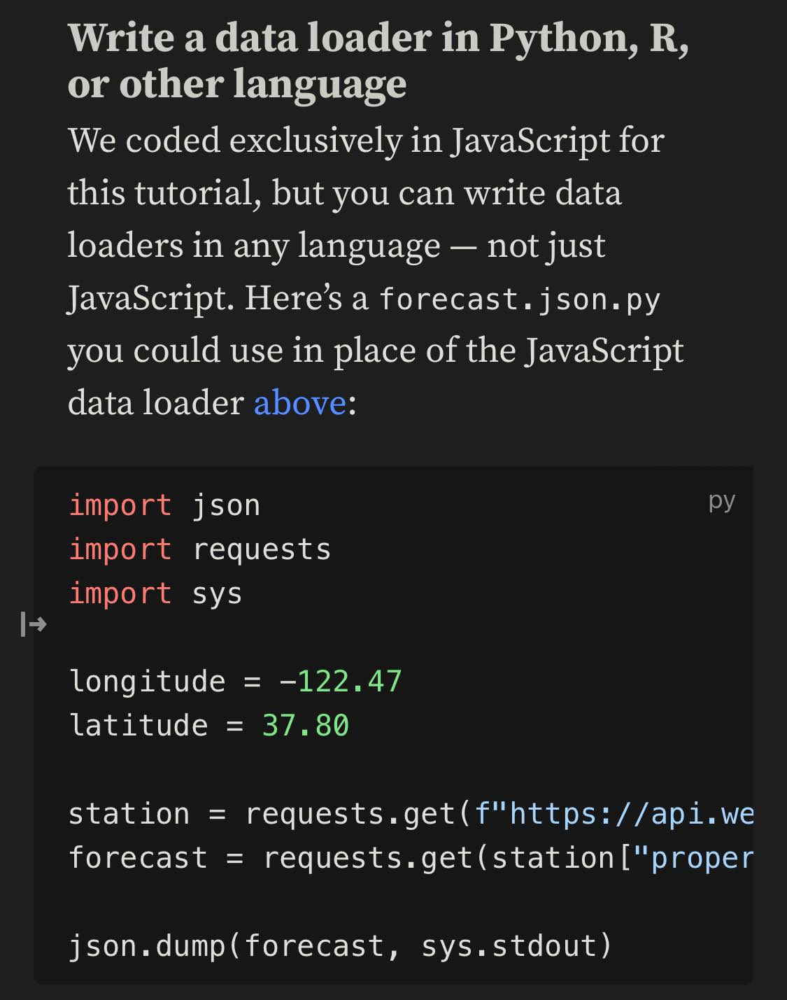

[Observable Framework](https://observablehq.com/framework/) seems like a nice competitor to Quarto. It seems like it has far fewer features, but some other more specialized features. 

Things they can both do:

- use markdown to build websites and apps
- Use Observable for plots and reactivity
- Load data from any format, using any language

Things Quarto excels at:

- more full featured - can be a blog, a site, etc. 
- can execute raw R or Python code. 

Things Observable seems better at (based on glancing the docs only):

- More beautiful
- More powerful reactivity

Seems like observable is good for people who prefer JavaScript for plotting. 

{.preview-image}

[Getting started | Observable Framework](https://observablehq.com/framework/getting-started

Loading data using Python (though there are default CSV and Apache parquet/arrow loaders too)

{.preview-image}