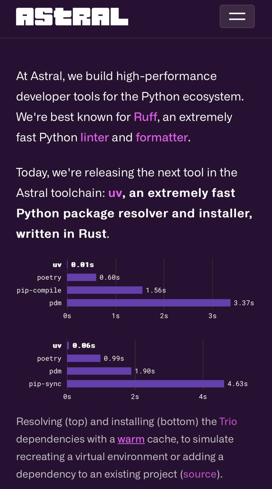

[uv: Python packaging in Rust](https://astral.sh/blog/uv)

- replaces `pip`
- Does what `poetry` does

Sad that Python developers think Python can't even maintain itself...it has to be written in Rust. 

<blockquote class="twitter-tweet">
Announcing uv: an extremely fast Python package installer and resolver, written in Rust.  uv is designed as a drop-in alternative to pip, pip-tools, and virtualenv.  With a warm cache, uv installs are near-instant. Here, it&#39;s &gt; 75x faster than pip and pip-tools. <a href="https://t.co/wrvaudUn6i">pic.twitter.com/wrvaudUn6i</a>
&mdash; Charlie Marsh (@charliermarsh) <a href="https://twitter.com/charliermarsh/status/1758216803275149389?ref_src=twsrc%5Etfw">February 15, 2024</a></blockquote> 

{.preview-image}
