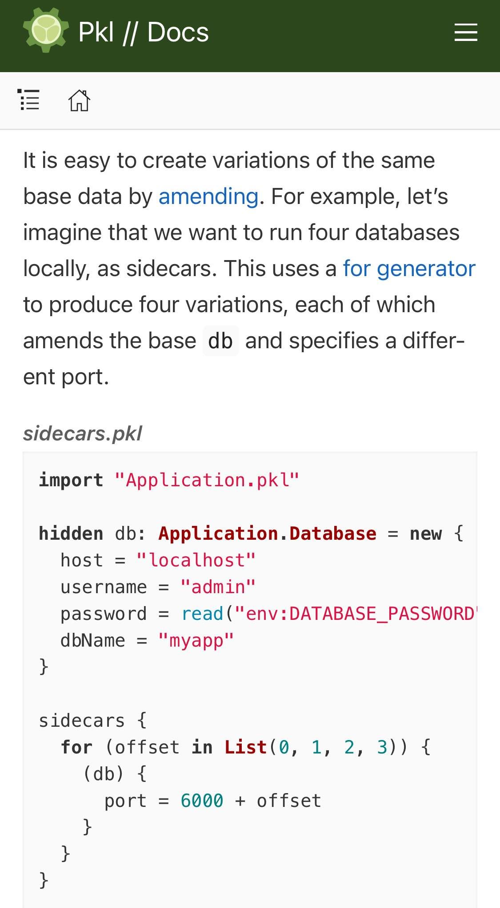

[Pkl](https://pkl-lang.org/blog/introducing-pkl.html) is the new kid on the block. 

Have you ever built a config for a modeling pipeline? Surely, if you've built a pipeline to do experiments you've wondered how you can quickly iterate through a bunch of different settings to see which model is the best for your use case. 

Maybe you want to generate a list of hypothesis to test, and then compare and contrast them. 

Like any good data scientist you've created a system to loop over some settings. 

It's the big challenge of data science: how do I configure something? Should I build this function to do one thing or should I build a development environment where I can explore a thousand things? If I build a development environment how do I know if all the things I've configured aren't going to be moot in a few weeks or months?

I don't have the answer to those questions. But perhaps how we design our configs can affect those design decisions. 

Pkl is cool because it lets you do a for loop to  output configs. 

Here's a basic config file per their docs:

{.preview-image}

And here's that config looped and rendered:

{.preview-image}

# Application to DS

I'm not 100% sure that this is any easier for a Python developer than just using ChatGPT to loop some parameters and spit out a bunch of yaml files. Because YAML does have some validation to it. And YAML has been around a long time. 

Anything's better than Python's ConfigParser...yuck. 

Reminds me of [Protocol Buffers Documentation](https://protobuf.dev/) but honestly I don't know much about this stuff. 

But it's nice to see people are thinking about configs...

