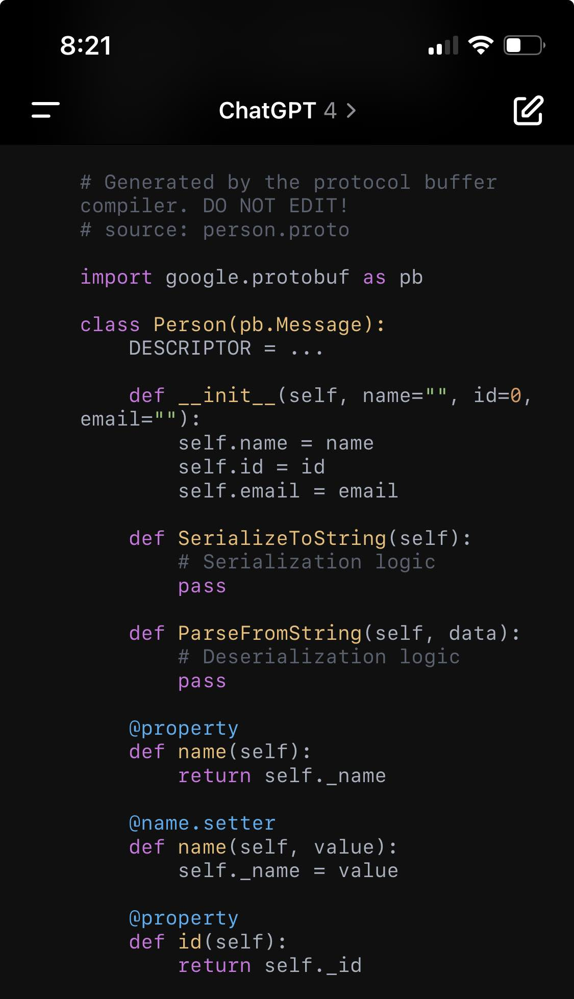

If you want a guide on Protobufs this isn't it. These are my notes. Just stumbled on this tonight after having seen these all over the place at Google and I wanted to learn something. 

See [Protocol Buffers Documentation](https://protobuf.dev/) and ChatGPT. [Pkl for Configuration Management](pkl-for-configuration-management.md) made me think of this. 
# The point of a Protobuf

- write one file
- This file defines data structure, but not the data itself 
- Compile it to different languages (like Python)
- A file in Python will be have a class defined with the properties in it
- When you serialize data (send via JSON or something over an API) the other service knows how to read that data file immediately (if you built it and gave it the proto)
	- This makes sense to me why Google used this everywhere. They have one service in Python and another in Java and another in Go. To get them talking to each other they need a common data structure to read from. 
	- The setters and getters help with the parsing a JSON blob for example. 

Like first you define the protobuf

{.preview-image}

And then you compile it via a bash command and it turns to this:

{.preview-image}