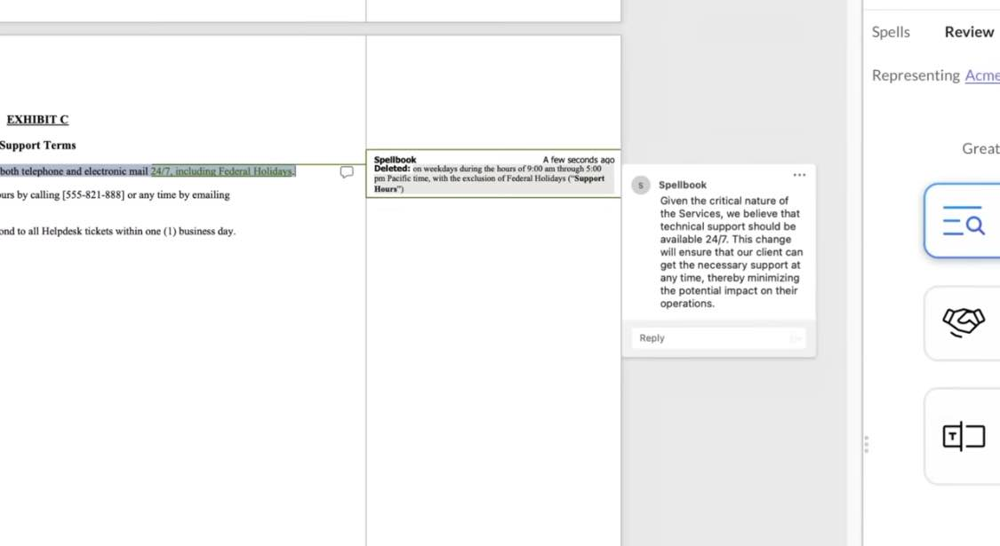

The AI world heats up with another legal tech offering.

[GPT-4 for Lawyers is now available | Spellbook](https://www.spellbook.legal/gpt-4-for-lawyers)

- Works in word
- Suggests edits (redlines) automatically to achieve your goals

{.preview-image}

{.preview-image}
