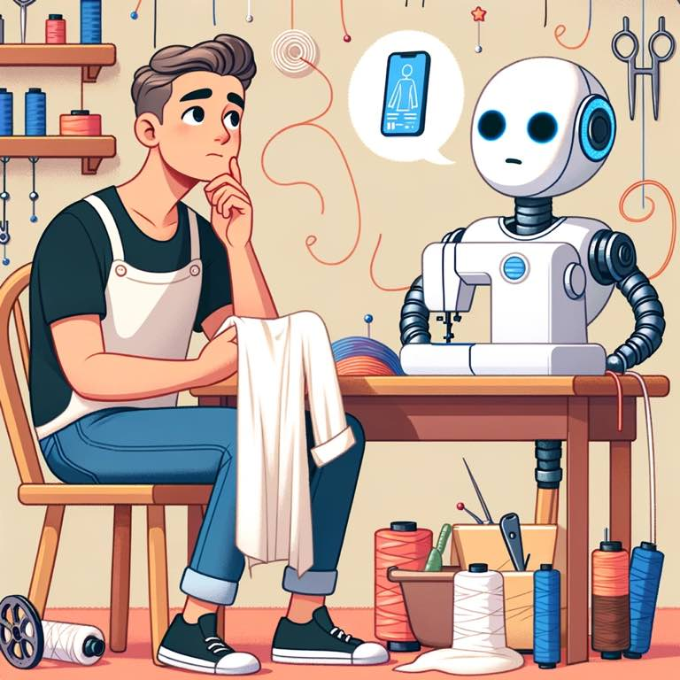

In a [recent MIT article](https://mitsloan.mit.edu/ideas-made-to-matter/4-questions-to-ask-swapping-out-human-labor-ai), the author discusses how to know if you're ready for AI adoption. It boils things down to a rather obvious four-step questioning process:

1. How much time would I save if I used AI?
2. How expensive is the task? (How expensive is the salary of the person doing the task.)
3. How capable is the AI of completing the task successfully?
4. How easy is it to determine if the output is good/correct?

I say obvious because these are actually just questions you'd ask of any task worth doing by any person at your company. In every decision in running a business, there is an ROI question at play - what does this person cost me, what's the return?

{.preview-image}

# Knowing what you don't know, and how to know you know it

The author lays out the hypothetical "I asked this ChatGPT to write something in Perl and it did it well on the second try!"

Consider that. Do you know what Perl is? Would you know how to evaluate if the code is complete? How would you execute such code - do you know the programs to run?

AI cannot solve these environmental, contextual problems yet. It can't think through all the nuance. And, if you have an expensive salary, there's a reason: you have a lot of experience. Experience to know what Perl is. Experience to recognize the code's flaws and poor design patterns. This makes you all the more valuable *with* AI. 

On the other hand, a highly creative, curious person could just ask AI "what programming languages are good for this task?" Like Neo in *The Matrix* when he "downloads kung-foo" into his brain, we all can get up to speed a lot faster.[^1]

# *How* do I adopt AI? (Not "should")

To me, the question isn't "do these four questions check the box"? Instead, I see AI as an always-on strategy with various ranges of usefulness:

1. Do you care what the final product looks like? 
	- Are you okay with an 80% solution? 
	- Is this throwaway work?
	- Do you plan to maintain this code as part of a 10,000 line code base?
	- Do you just need ideas to get started?
1. What are the risks in firing my experts? 
	- Who will catch the mistakes of the AI? What if it's wrong?
	- In many aspects of your business the risk of being wrong might be a lot lower than you think. 
1. What *can't* it do well?
	- Assume AI is doing everything at your company - what would that look like?
	- Give AI the benefit of the doubt first, then work backward from what it can't do. 

I think that AI holds great power to aid our jobs in a lot of ways. It *will* replace a lot of jobs, just as there are far fewer farmers today than a hundred years ago. Those farmers are far more effective than ever before - we get more yield for less. It will replace *part* of your job - the stuff you know how to do but would rather have someone else do it.

Coders *will* be highly automatable, especially those who think otherwise. Lawyers. Graphic designers. Marketers. This is a cycle as old as time: people and businesses who think they have a strong hold on the market (think: BlackBerry, *Innovators Dilemma*) are the ones who always get eclipsed. 
# Learn the new skillset 

Have everyone at your company use it today. It's the new programming language. It's the new way of authoring. And yes, prompt engineering (how you ask it questions) widely impacts its usefulness. Therefore, we all need to learn how to prompt engineer. 

*That* is the new skillset: **knowing what question to ask and how to pressure test its validity**. In essence, the learning acceleration curve has skyrocketed, and one person can now actually be good at many things a lot faster. It's the curious person who will win. It's the visionary. The evaluator. The one who knows where they want to go, can discern if the steps they're taking are taking them to their destination, and who have the ability to adapt and course correct when necessary.

For now, AI can hardly do things outside data it was trained on. In the future 10 years that may change. If so, we'll all be on the edge of scientific discovery, pushing the bounds of creative work, and focusing on the nuance that will win/lose that legal case. AI will have a seat at the table. But so will we. 

[^1]: I've read stories of people without technical backgrounds building websites with GPT. On the surface this is cool. Now do they care to keep doing that? Is that their personality? Are they going to get bored? This is the differentiator. And the people who stick with GPT to build a website and remain curious are the ones who will get ahead. Those who give up won't. 