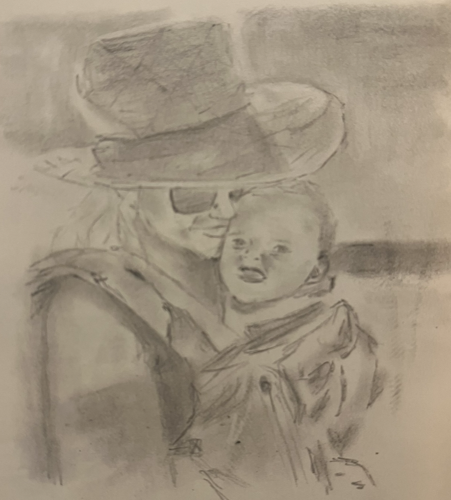

"Tell her you traced that"

my daughter had just asked me if I drew this. I said yes. But I omitted some details. 

What does it matter I traced it? I wanted a picture that didn't look like two potatos. 

Nowadays, the question of: "did you draw that" and "did you actually write that" will perhaps become more relevant. 

I've never coded without using Google. Now I don't code without AI. Is that cheating? Am I tracing??

Ultimately, nobody cares how it was made. Just that it was made to spec. 

Similarly, a relative likes to bow hunt. Why? It's more fun than a rifle. More of a challenge. 

I didn't want a challenge. I wanted a better drawing. So I traced. 

In the future, we'll still write "by hand". But not to create a great product. But because it's meaningful to experience as a human. 

